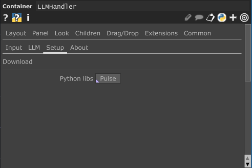

На данный момент содержит .tox файл, позволяющий обрабатывать слова и из них получать эмоцию

# LLM Handler

## Установка

Сама установка LLM **требовательна к версиям програмного обеспечивания**

> Предритальная установка

-  Версия Python ([скачать](https://www.python.org/ftp/python/3.11.1/))

```
Python 3.11.1
```

-  Версия TouchDesigner ([скачать](https://derivative.ca/download/archive))

```
64-bit Build 2023.12120
```

> Настройка окружения TouchDesigner

-  `Edit` -> `Preferences` (Alt + p)
-  Во складке `Python 64-bit Module Path` указать путь до библиотек python
-  Папка выгядит так: `$ПУТЬ_ДО_ПАПКИ$/Python311/Lib/site-packages`

> Установка библиотек

-  Во вкладке `Setup` можно установить все необходимые библиотеки (Откроется консоль и автоматически загрузит)

<p align="center">
  
</p>
